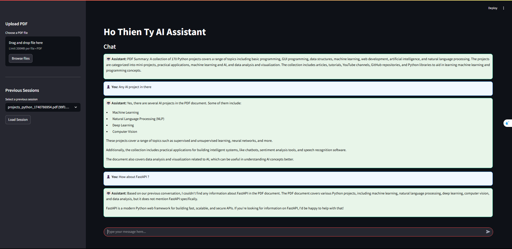

# AI-Assistant-for-PDF
Sumarization and chat with AI through PDF we provided

## Screenshots

*Main Interface*

*Chat Interface*

*History Interface*

## Overview 
This document describes the development of a chatbot capable of summarizing PDF files after they are 
uploaded. The chatbot will maintain conversation history and utilize various frameworks and models to 
provide efficient responses. 

## Technology Stack 
- Backend: FastAPI (for API development) 
- Database: SQLite (to store chat history) 
- LLM Framework: LangChain (to manage interactions with the language model) 
- Model: Ollama (running locally) using llama3.2:3b
- Frontend: Streamlit (for user interaction and file upload) 

## Project Structure 
### Backend
- `main.py` - FastAPI application 
- `db.py` - SQLite database setup 
- `summarizer.py` - PDF processing and summarization logic 
- `models.py` - Database models and schemas 

### Frontend
- `app.py` - Streamlit application 
- `ui_helpers.py` - Helper functions for UI components 

## Functionality 
1. **Upload a PDF File**  
   - The user uploads a PDF file via the Streamlit frontend. 
   - The file is sent to the backend for processing. 
2. **Summarization**  
   - The backend extracts text from the PDF. 
   - LangChain interacts with llama3.2:3b (via Ollama) to generate a summary. 
3. **Chat with History**  
   - Users can ask questions about the uploaded document. 
   - The chatbot maintains conversation history using SQLite. 
4. **User Interface**  
   - Streamlit provides an intuitive UI for file uploads and chat interactions. 

## Next Steps 
- Implement backend API with FastAPI to handle file uploads and processing. 
- Integrate LangChain with llama3.2:3b  Ollama. 
- Develop frontend using Streamlit for seamless user experience. 
- Store and retrieve chat history using SQLite. 

